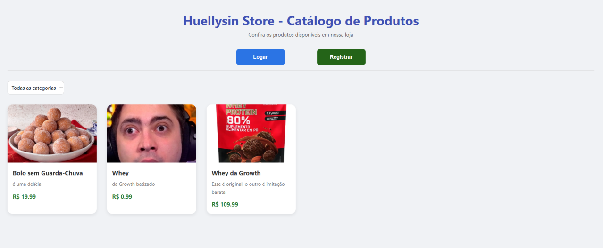

# 🛍️ Huellysin Store - Catálogo de Produtos (Front-end)

Este é o front-end da aplicação **Huellysin Store**, um catálogo de produtos com painel administrativo. A interface é construída com React + Redux Toolkit + TypeScript, conectando-se a uma API Django REST com autenticação via JWT.



---

## 🖼️ Tecnologias Utilizadas

- React 18 + Vite
- TypeScript
- Redux Toolkit
- Axios
- Styled-Components
- React Router
- JWT no LocalStorage

---

## 📦 Funcionalidades

- Catálogo público com filtro por categoria
- Painel administrativo (CRUD completo):
  - Criar, editar e remover produtos
  - Cadastrar e gerenciar categorias
- Autenticação com Login e Logout
- Registro de novos usuários
- Validação de formulários manual (sem bibliotecas externas)
- Feedbacks visuais de erro e sucesso

---

## 📂 Organização do Projeto

```
src/
├── app/                # Store Redux configurada e algumas outras funcionalidades
├── features/           # Slices para Auth, Produtos e Categorias
├── pages/              # Páginas principais
├── components/         # Componentes reutilizáveis (ex: ProductCard, Modals, Inputs)
├── api/axios.ts        # Instância do Axios com headers configurados
├── types/              # Tipagens globais
└── styles/             # Possui os estilos globais
```

---

## 🧪 Execução Local

### 1. Clone o repositório:

```bash
git clone https://github.com/seu-usuario/huellysin-store-frontend.git
cd huellysin-store-frontend
```

### 2. Instale as dependências:

```bash
npm install
# ou
yarn
```

### 3. Inicie o projeto localmente:

```bash
npm run dev
# ou
yarn dev
```

### 4. Acesse o projeto no localhost

---


## 🔧 Configurações de API

A API espera que o back-end esteja rodando localmente na porta `8000`.

O Axios já está configurado para acessar:

```
http://localhost:8000/
```

---

## 📌 Observações

- O token JWT é armazenado no `localStorage`.
- O catálogo público funciona mesmo sem autenticação. Caso não funcione, verifique se o localStorage esteja sem informações inválidas.

---

## 🔗 Back-end

Este front-end se conecta à API Django disponível neste repositório:

👉 [Repositório do Back-end](https://github.com/hav0kinho/Case-EBAC-Backend)

---

## ✅ Fluxos de Tela

| Página              | Descrição                                |
|---------------------|-------------------------------------------- |
| `/`                 | Catálogo de produtos com filtro por categoria |
| `/login`            | Tela de login com JWT                      |
| `/register`         | Registro de novos usuários                 |
| `/admin`            | Painel com listagem, cadastro e edição de produtos e categorias |

---

## 📩 Contato

Desenvolvido por **Ruallyson Felype Travassos de Moura** para um Case Técnico :D  
📧 [ruallysonfelype@gmail.com]
